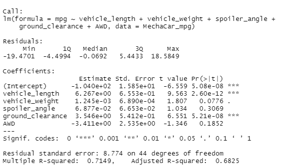
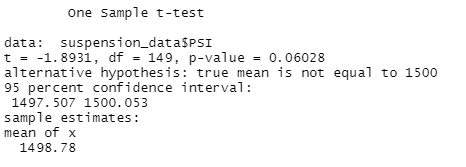
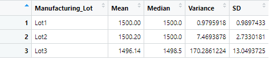
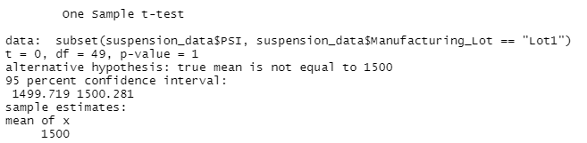
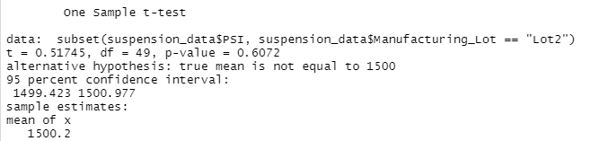

# MechaCar_Statistical_Analysis

## Background

A few weeks after starting his new role, Jeremy is approached by upper management about a special project. AutosRUs’ newest prototype, the MechaCar, is suffering from production troubles that are blocking the manufacturing team’s progress. AutosRUs’ upper management has called on Jeremy and the data analytics team to review the production data for insights that may help the manufacturing team.

1. Deliverable 1: Linear Regression to Predict MPG -Perform multiple linear regression analysis to identify which variables in the dataset predict the mpg of MechaCar prototypes

  

## Linear Regression to Predict MPG
Q1 - Which variables/coefficients provided a non-random amount of variance to the mpg values in the dataset? 
A1 - ** Vehicle Length & Ground Clearance have a significant impact on mpg usage. **

Q2 - Is the slope of the linear model considered to be zero? Why or why not? 
A1 - ** The intercept is significant and is not zero we did that by using the PR(>|t|) **

Q3 - Does this linear model predict mpg of MechaCar prototypes effectively? Why or why not?
A3 - **The Multiple R-sqared value is 0.71 which shows the model does well in predicting mpg (r-squared over .7 is a good model) **

2. Deliverable 2: Summary Statistics on Suspension Coils -Collect summary statistics on the pounds per square inch (PSI) of the suspension coils from the manufacturing lots 

  

  

Q1 - The design specifications for the MechaCar suspension coils dictate that the variance of the suspension coils must not exceed 100 pounds per square inch. Does the current manufacturing data meet this design specification for all manufacturing lots in total and each lot individually? Why or why not?
A1 - The total specifications for all manufacturing lots has a total variance of 62.29, which is less than 100.

 

 ** Lot 3 is well over 100 PSI  and shows a significant difference from the mean population **

3. Deliverable 3: T-Test on Suspension Coils -Run t-tests to determine if the manufacturing lots are statistically different from the mean population

  

  

  

 ** As seen above - Lot 3 is significantly different in comparison to the other lots and is consistent with other data.

4. Deliverable 4: Design a Study Comparing the MechaCar to the Competition - Design a statistical study to compare vehicle performance of the MechaCar vehicles against vehicles from other manufacturers. For each statistical analysis, you’ll write a summary interpretation of the findings.

## Study Design: MechaCar vs Competition

There are other items you can review and dig into like car weight and horsepower versus mpg.

* What metric or metrics are you going to test?

  Most consumers are interested in overall cost of the vehicle (dependendent variable) based on multiple reasons, like: MPG / Safety features / horsepower etc (independent variables)

* What is the null hypothesis or alternative hypothesis?

  Null - MechaCar is fairly priced based on overall vehicle model/package as compared to competitors.

  Alternative - Competitors have the advantage, as Mechacar is NOT fairly prised based on overall vehicle model/package.

* What statistical test would you use to test the hypothesis? And why?

  The best statistical test for this would be multiple linear regression to show the highest correlation between sales prices and vehicle model and package.

* What data is needed to run the statistical test?

  Sales data by vehicle model/package compared against the closest competitors sales data and vehicle model/package.
 